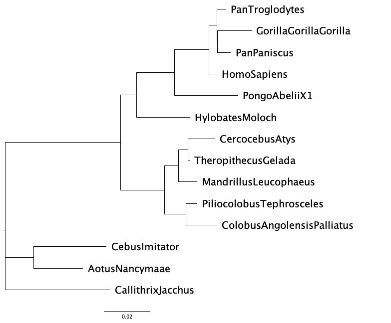

```{r setup, include=FALSE}
knitr::opts_chunk$set(echo = TRUE)
```

## Introduction

I bought the 23andMe kit two years ago out of interest and got an interesting pedigree and genetic report from a few milliliters of saliva. One of the conclusions of health predisposition caught my attention: I have slightly increased risk of age-related macular degeneration (AMD) for carrying two copies of a genetic variant in the ARMS2 gene.

AMD is a progressive chronic disease but may cause irreversible vision loss. The onset of the main symptoms is obscure, including blurred patches seen in the center of the vision, straight lines that appear to bend and fluctuate, etc. The symptoms become progressively more severe with age, making it difficult, if not impossible, for the elderly to perform daily tasks on their own. In addition to external environmental and a daily diet deficient in vitamins A, C, E, and zinc, genetic factors also bear a significant part of the responsibility[1]. The ARMS2 gene mutation is one of them.

The ARMS2 gene produces proteins with unknown functions, while according to studies, it may be the most common cause of irreversible vision loss among older adults[2]. ARMS2 protein could be found primarily in the placenta (a temporary organ for baby nutrition in mother's uterus) and in the retina (a light-sensing tissue in the back of the eye). Several studies[3,4,5] claimed that the ARMS2 gene appeared to be present only in primates, or animals with a macula specifically. This conclusion is consistent with the result of `BLAST` on NCBI. In this project, the phylogenetic relationships among several taxa were explored.

## Methods

For the interested ARMS2 gene, 36 nucleotide sequences were obtained from the result of `BLAST`. After screening with query coverage greater than or equal to 45%, 14 sequences remained including the ARMS2 gene from human.

Four major methods were applied to phylogenetic tree construction: maximum parsimony, distance based neighbor joining, maximum likelihood, and Bayesian method. The maximum parsimony analysis was carried out by `PAUP`. MP score was identified by branch-bound search and heuristic search, and the phylogenetic tree was built by a 200 replicate bootstrap search with 10 random additions TBR replicates per bootstrap replication. The bootstrap result was analyzed by consensus trees. The neighbor joining method was based on `FastME` and the distance matrices were computed by F84 which is the default. Two post-processing NNI and SPR were tested simultaneously to compare the results. For maximum likelihood method, `RAxML-NG` was used and the sequence evolution model was set as GTR+G. Bootstrap analysis of 1000 replicates was utilized and the support metric TBE and FBP were checked as well. Finally, `MrBayes` was used for Bayesian modeling. GTR+G model was assumed and the the prior for the rates heterogeneity was changed to exponential distribution with parameter 0.05. The number of cycles of MCMC was 300,000 and the frequencies with which the Markov chain sampled was 100. Two independent analysis with four chains each were run by default. The convergence was validated by the average standard deviation of split frequencies. The resulted consensus tree from `MrBayes` came to comparison at last.

Based on all the resulted trees, ML evaluation and tanglegram helped identify the topological differences. Based on the available results, *Callithrix jacchus* which located rather far away from the others was set as the outgroup. One hypothesis test was carried out to check whether human and gorilla has more closely related ARMS2 gene by GTR+G+I from `MrBayes`. Besides, another hypothesis testing about molecular evolution of the ARMS2 gene was performed using `codeml` from `PAML`.

## Results

### Maximum parsimony

```{r, echo=FALSE,out.width="49%",out.height="30%",fig.cap="(left) majority rule consensus tree. (right) strict rule consensus tree.",fig.show='hold',fig.align='center'}
knitr::include_graphics(c("bootMajRule.tree.jpg","bootStrict.tree.jpg"))
``` 
From figure 1, there were some differences between these two consensus trees, the difference is in the resolution of the grouping. Majority rule consensus tree were all binary while strict rule consensus tree had some nodes with more than 2 leaves. This explained that some groupings in bootstrap cannot achieve accurate results. However, these two trees could roughly represent the affinities of ARMS2 genes in these 14 species.

The branch and bound search, and the heuristic search with 100 random addition replicates and 4 branch swapping options (No, NNI, SPR, TBR) gave the same maximum parsimony score as 236 and the number of trees retained was 1. The phylogenetic tree is shown as figure 2, and it was pretty close to the majority rule consensus tree.
```{r, echo=FALSE,out.width="49%",out.height="30%",fig.cap="The only best tree built by heuristic search of maximum parsimony",fig.show='hold',fig.align='center'}

``` 

### Neighbor joining

The tree built by neighbor joining method is shown as figure 3. Here the length of the branches, i.e. the edge weights, had a more practical meaning than the tree constructed by the previous method, which is the distance between species. Overall the grouping was quite similar to the maximum parsimony tree except the clade (Pan Troglodytes, (Gorilla Gorilla Gorilla, Pan Paniscus)).

Two post-processing NNI and SPR were tried and no difference was found in the output tree and this might be the indication of a well-built tree by neighbor joining. The model assumed here was F84, which allowed the four nucleotides to be present in different frequencies. It was also flexible for different rates of transitions and transversions.
```{r, echo=FALSE,out.width="49%",out.height="30%",fig.cap="Phylogenetic tree built by neighbor joining method",fig.show='hold',fig.align='center'}

``` 

### Maximum likelihood

To verify the accuracy of the tree, bootstrap analysis would resample columns of characters out of the result and rebuild the tree for dozens of times, and for each time it would test if the same nodes were recovered. The final proportions of recovery were mapped on the best scoring ML tree in figure 4.

ML tree inferece here was under the GTR+GAMMA. FBP (binary presence/absence of bipartitions from replicate trees in the best-scoring ML tree) and TBE (the minimum number of taxa that have to be transfered or removed to make those branches identical) were found similar for the bootstrap support analysis, and the grouping of best-scoring ML tree was quite similar to the previous two.
```{r, echo=FALSE,out.width="49%",out.height="30%",fig.cap="(left) TBE bootstrap values mapped to the best-scoring ML tree. (right) the best-scroing ML tree.",fig.show='hold',fig.align='center'}
knitr::include_graphics(c("all.raxml.supportTBE.tre.jpg","all.raxml.bestTree.tre.jpg"))
``` 

### Bayesian method

The Bayesian analysis was performed on the unpartitioned alignments using the same GTR+GAMMA model. Again, the consensus tree from the later cycles of MCMC was still similar to the previous ones.

Based on the observation that all four methods gave trees with very similar topologies, an attempt to construct rooted trees was made. *Callithrix Jacchus*, which is relatively distant from the other taxa, was selected as the outgroup and the re-rooted tree can be viewed in figure 5 (right).

From the rooted tree, one topological hypothesis between ARMS2 from human and that from gorilla was conducted to see whether they were more closely related to each other than the others or not. Results from trees representing alternative hypotheses are shown in Table 1. An average standard deviation that approached 0 indicated convergence of the MCMC.

Take the harmonic mean of log likelihoods from two chains for each analysis to compute the ln-Bayes factor $K=\ln [B F(M_0, M_1)]=\ln [P(X \mid M_0)]-\ln [P(X \mid M_1)]$. $K=-2.61$ indicated that we should favor the latter one which was "human and gorilla does not have a more closely related ARMS2 gene than the others". This can be confirmed by the greater log likelihood that the latter one produced. The tree was omitted here since it was just the same as figure 5.
```{r, echo=FALSE,out.width="49%",out.height="30%",fig.cap="(left) concensus tree from Bayesian modeling without outgroup. (right) concensus tree from Bayesian modeling with Callithrix Jacchus as outgroup.",fig.show='hold',fig.align='center'}
knitr::include_graphics(c("arms2.con.tre.jpg","arms2.out.con.tre.jpg"))
``` 

\begin{table}[ht]
\caption{Summary of topological hypothesis between Huamn and Gorilla by Bayesian model}
\centering
\begin{tabular}{c|c|c}
\hline
& Human, Gorilla more closely related & Human, Gorilla not more closely related\\
\hline
 Average SD of split frequencies & 0.011707 & 0.006244 \\
 Arithmetic mean & -2494.34  & -2492.60   \\
 Harmonic mean & -2507.86       & -2505.25 \\
 \hline
 $K$ & \multicolumn{2}{c}{-2.61} \\
 $BF$ &  \multicolumn{2}{c}{ 0.07353454}\\
\hline
\end{tabular}
\end{table}

### Trees comparison

Interestingly, the structures of the phylogenetic trees generated by each of the above four methods looked very similar. In order to verify more carefully (besides direct comparison by eye), the log-likelihood values and AIC, BIC of the trees generated by each method were calculated separately using the parameters estimated by the ML approach; also, the tanglegram was used to compare the trees side by side to see if there were any grouping or topological differences between the mutual trees.

As can be seen in Table 2, the trees generated by MP, ML and Bayes had very close log-likelihood, AIC and BIC, if not identical. The log-likelihood of NJ tree, on the other hand, was slightly smaller. This reflected that in the NJ tree, the clade (Pan Troglodytes, (Gorilla Gorilla Gorilla, Pan Paniscus)) might not be very accurately grouped. Corresponding with the finding that the same species from two trees in the tanglegram were connected by straight lines, it showed that the trees generated by the four methods were topologically identical. This phenomenon indicates a clear taxonomic relationship between the ARMS2 gene sequences of the 14 different species selected for the experiment.

\begin{table}[ht]
\caption{ML evaluation of 4 methods}
\centering
\begin{tabular}{c|c|c|c|c}
\hline
& MP & NJ & ML & Bayes\\
\hline
 Final LogLikelihood & -2480.383861 &  -2482.833945 & -2480.384237 & -2480.384254\\
 AIC & 5028.767723  & 5033.667889 & 5028.768474 & 5028.768508\\
 BIC & 5189.131945       &  5194.032111 & 5189.132696 & 5189.132730\\
\hline
\end{tabular}
\end{table}

```{r, echo=FALSE,out.width="49%",out.height="30%",fig.cap="Tanglegram of tree by maximum parsimony vs. tree by Bayesian method. In fact, the mutual comparisons between trees built by the previous four methods were the same as the one shown here.",fig.show='hold',fig.align='center'}
knitr::include_graphics("parsimonybayes.jpg")
``` 

### Hypothesis testing about molecular evolution

Based on the rooted tree on the figure 5 (right), I attempted a hypothesis test with very naive assumptions about the evolutionary relationship of ARMS2. For the roughly three clades, different selection pressures were assumed in each of the branches as $A_0$, $A_1$, and $A_2$. Likelihood ratio tests were conducted to detect whether there existed any negative or positve selections. Note that the last alignments were deleted according to the `PAML` FAQ [6], and the length became 825. This was because `codeml` from `PMAL` required that the sequence length is a multiple of 3, for potentially calculation $dS$ and $dN$ from intron or noncoding sequences.

From table 3, no significant differences were found from the 2 tests. The estimated ratios $dN/dS$ were also close to 1. These could indicate that ARMS2 gene is evolving neutrally. However, the choice of selection pressure and the outgroup might not be identical or close to the fact of nature, and the result might be different if we tried another assumptions.

```{r, echo=FALSE,out.width="49%",out.height="30%",fig.cap="Assumed molecular evolution on the built tree",fig.show='hold',fig.align='center'}

``` 
\begin{table}[ht]
\caption{Summary of estimation and likelihood ratio test about molecular evolution}
\centering
\begin{tabular}{c|c|c|c}
\hline
& $H_0: \omega_{A_0}=\omega_{A_1}=\omega_{A_2}$ & $H_1: \omega_{A_0}\neq\omega_{A_1}=\omega_{A_2}$ & $H_2: \omega_{A_0}\neq\omega_{A_1}\neq\omega_{A_2}$\\
\hline
 $\hat{\omega}_{A_0}$ & 1.0672 & 1.4700 &1.4920 \\
 $\hat{\omega}_{A_1}$ & 1.0672  & 0.9670 &0.8048 \\
 $\hat{\omega}_{A_2}$ & 1.0672  & 0.9670 &1.0200 \\
 Log Likelihood & -2357.246314 & -2356.612617 & -2356.443949\\
 \hline
 Test statistic & & 1.267394 & 0.337336 \\
 degrees of freedom &  & 1 & 1\\
 $p$-value($\alpha=0.95)$ & & 0.260274 & 0.561392\\
\hline
\end{tabular}
\end{table}
\newpage

## Conclusions

ARMS2, an AMD-related gene, is normally found only in higher primates. This project identified the ARMS2 gene in 14 related species by `BLAST`, and phylogenetic analysis of these sequences was performed. Four common methods of tree construction, MP, NJ, ML and Bayes, were tried and the resulting trees were compared using ML evaluation and tanglegram presentation. Very interestingly, I found that the structures of all trees were identical, suggesting that there may be a very strong signal of taxonomic relationships between these sequences. Based on the rather large distance between *Callithrix Jacchus* and the rest, the rooted tree is built by setting *Callithrix Jacchus* as an outgroup.

In addition, I attempted two hypothesis tests on these sequences, namely whether the ARMS2 gene is more closely related in humans and gorillas than in all other species, and whether there is positive or negative selection for molecular evolution after setting *Callithrix Jacchus* as the outgroup. The results showed that neither hypothesis was valid.

The structure of the tree is very clear and the sequence contains only one gene, which, due to the simplicity of the data, means that selecting the most appropriate parametric model or distance metric by likelihood ratio test in ML analysis or attempting gene or codon partition in Bayesian analysis is not quite necessary, yet the two hypothesis tests attempted here are worth using a more nuanced alternative hypothesis to find possible signals in the sequence.

\newpage
## References

[1] Fritsche, L. G., Loenhardt, T., Janssen, A., Fisher, S. A., Rivera, A., Keilhauer, C. N., & Weber, B. H. (2008). Age-related macular degeneration is associated with an unstable ARMS2 (LOC387715) mRNA. $\textit{Nature genetics}$, 40(7), 892-896.

[2] Lim, L. S., Mitchell, P., Seddon, J. M., Holz, F. G., & Wong, T. Y. (2012). Age-related macular degeneration. $\textit{The Lancet}$, 379(9827), 1728-1738.

[3] Francis, P. J., Appukuttan, B., Simmons, E., Landauer, N., Stoddard, J., Hamon, S., ... & Neuringer, M. (2008). Rhesus monkeys and humans share common susceptibility genes for age-related macular disease. $\textit{Human molecular genetics}$, 17(17), 2673-2680.

[4] Micklisch, S., Lin, Y., Jacob, S., Karlstetter, M., Dannhausen, K., Dasari, P., ... & Skerka, C. (2017). Age-related macular degeneration associated polymorphism rs10490924 in ARMS2 results in deficiency of a complement activator. $\textit{Journal of neuroinflammation}$, 14(1), 1-15.

[5] Sun, S., Li, Z., Glencer, P., Cai, B., Zhang, X., Yang, J., & Li, X. (2017). Bringing the age-related macular degeneration high-risk allele age-related maculopathy susceptibility 2 into focus with stem cell technology. $\textit{Stem cell research}$&$\textit{therapy}$, 8(1), 1-7.

[6] Yang, Z. (2015) PAML FAQ. http://abacus.gene.ucl.ac.uk/software/pamlFAQs.pdf, 16.
